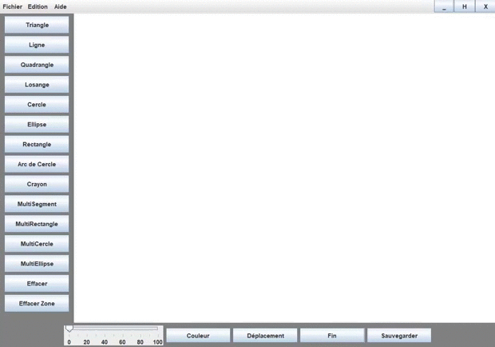
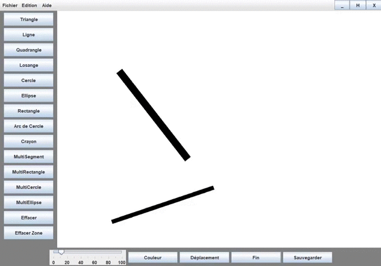
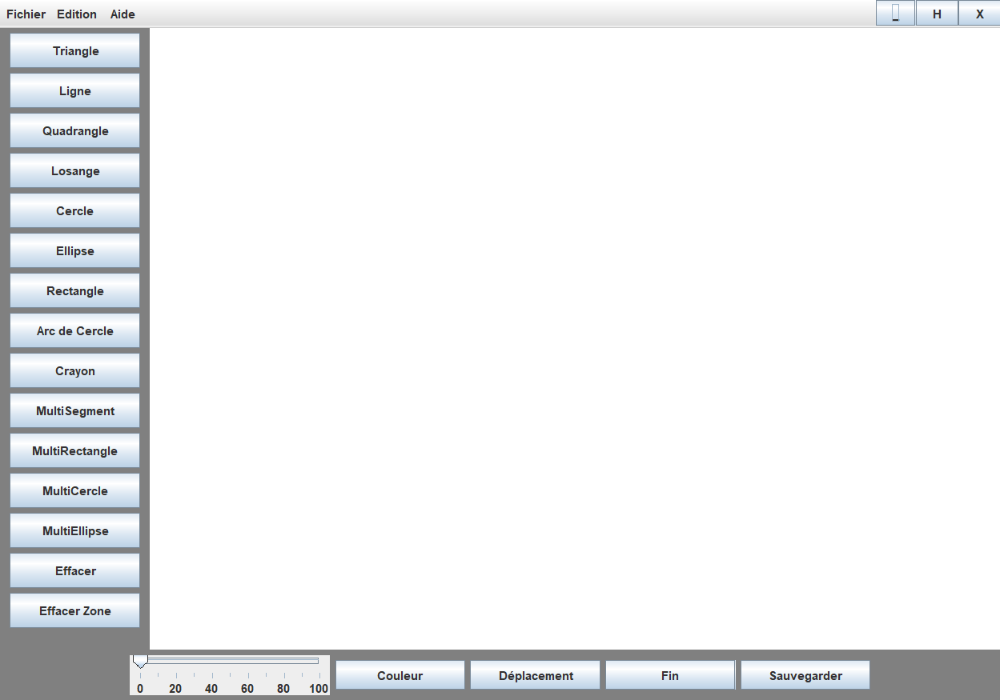

# Paint

> English version (Version française plus bas)

> Screenshots available below

A little Java Paint where you can create various shape like Triangles, rectangles, circles, ellipses, arcs, quadrangles, ...

## Features
* Paint various shapes (Triangle, line, quadrangle, losange,  circle, ellipse, rectangle, arc, ...)
* Erasing the board (By area or total)
* Save the board
* Move shapes
* Change shapes color and size

## Authors
* Deewens
* Arthur (https://github.com/Arthur57255)

---

> Version française

> Screenshots disponible plus bas

Un programme de dessin type Paint où vous pouvez créer différentes formes comme des triangles, des rectangles, des cercles, des ellipses, des arc de cercles, des quadrangles, ...

## Fonctionnalités
* Peindre des formes variées (triangle, ligne, quadrilatère, losange, cercle, ellipse, rectangle, arc, ...)
* Effacer le dessin (Par zone ou totalité)
* Sauvegarder le dessin
* Déplacer les formes
* Changer la couleur et la taille des formes

## Auteurs
* Deewens
* Arthur (https://github.com/Arthur57255)

# Screenshots

